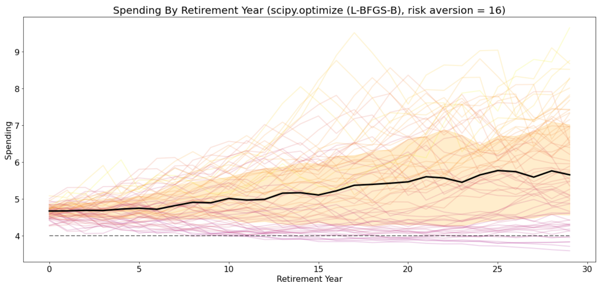
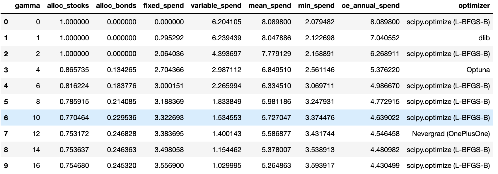

# swr
A framework for determining safe withdrawal rates, designed to generalize to:

- Any generator of historical asset returns (historical, Monte Carlo, roll your own market environment)
- Any asset allocation strategy (fixed weights, glidepath schedules, roll your own based on any parameters)
- Any withdrawal strategy (fixed withdrawal, variable percentage, combinations, glidepaths)
- Any metrics to evaluate retirement cohort outcomes (e.g. total spending, certainty equivalent spending, roll your own. Support for survival tables, i.e. calculate expected metric for living retirees taking into account retirement age and survivorship)
- Any (gradient-free) optimizer to find optimal parameters (e.g. asset allocation, withdrawal parameters) to maximize a metric in the given market environment





```python
FIXED_SPEND = 3.5
VARIABLE_SPEND = 1.0
ALLOC_STOCKS = 0.75
ALLOC_BONDS = 0.25
GAMMA  = 1.0

s = SWRsimulationCE.SWRsimulationCE({
    'simulation': {'returns_df': real_return_df,
                   'n_ret_years': N_RET_YEARS,
                  },
    'allocation': {'asset_weights': np.array([ALLOC_STOCKS, ALLOC_BONDS])}, 
    'withdrawal': {'fixed_pct': FIXED_SPEND,
                   'variable_pct': VARIABLE_SPEND,
                  },
    'evaluation': {'gamma': GAMMA},
    'visualization': {'histogram': True, 
                      'chart_1' : {'title': 'Years to Exhaustion by Retirement Year (%s, risk aversion = %d)' % (optimizer, GAMMA),
                                   'annotation': "Fixed spend %.1f, Variable spend %.1f, stocks %.1f%%" % (FIXED_SPEND, 
                                                                                                           VARIABLE_SPEND, 
                                                                                                           100 * ALLOC_STOCKS)
                                  },
                      'chart_2' : {'title': 'Spending By Retirement Year (%s, risk aversion = %d)' % (optimizer, GAMMA),
                                  },
                      'chart_3' : {'title': 'Portfolio Value By Retirement Year (%s, risk aversion = %d)' % (optimizer, GAMMA),
                                  },
                     }    
    
})

print(s)

s.simulate()

s.visualize()


```
